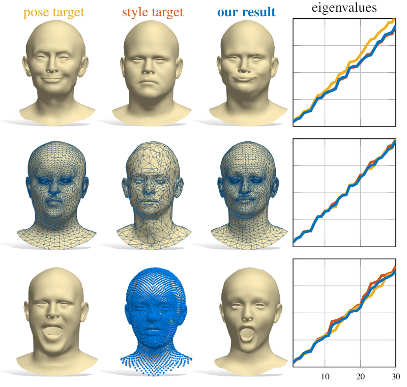
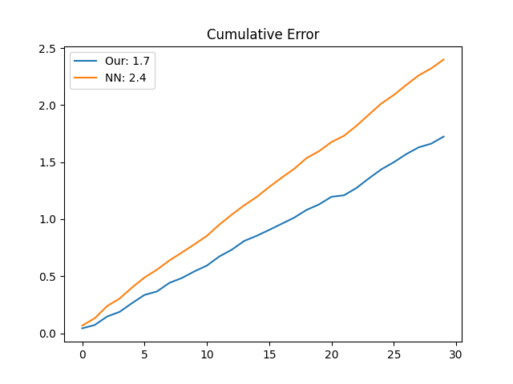

# Instant recovery of shape from spectrum via latentspace connections

This repository is the official implementation of [Instant recovery of shape from spectrum via latentspace connections](https://arxiv.org/abs/2030.12345). 
<p align="center">



## Requirements

To install requirements:

```setup
pip install -r ./code/requirements.txt
```

## Training

To train the model with FC encoder:

```train_FC
python ./code/train_dense.py
```

To train the model with PointNet encoder:
```train_PNet
python ./code/train_pointnet.py
```

The code is tested on:
Python 3.6
Tensorflow 2.0

## Pretrained models
To download the pretrained models:

```downlaod_pretrained
python ./models/download_pretrained.py
```
To download the datas:
```downlaod_pretrained
python ./data/download_data.py
```

## Evaluation

To replicate the shape from spectrum:

```eval_sfs
python eval_dense.py
```
The expected result on pre-trained model is:

|           | Our  | NN |
| ------------------ |---------------- | -------------- |
| full | 1.61e-05 |  4.47e-05 |
| 1000 | 1.61e-05 |  4.63e-05 |
| 500 | 1.71e-05 |  4.01e-05 |
| 200 | 2.13e-05 |  2.65e-05 |

To replicate the spectrum from pointcloud on a FLAME shape:
```eval_sfp
python eval_pointnet.py
```

The expected result on pre-trained model is:



## Citation
If you use our work, please cite our paper.

[](https://creativecommons.org/licenses/by-nc/4.0/)

This work is licensed under a [Creative Commons Attribution-NonCommercial 4.0 International License](http://creativecommons.org/licenses/by-nc/4.0/). For any commercial uses or derivatives, please contact us.
